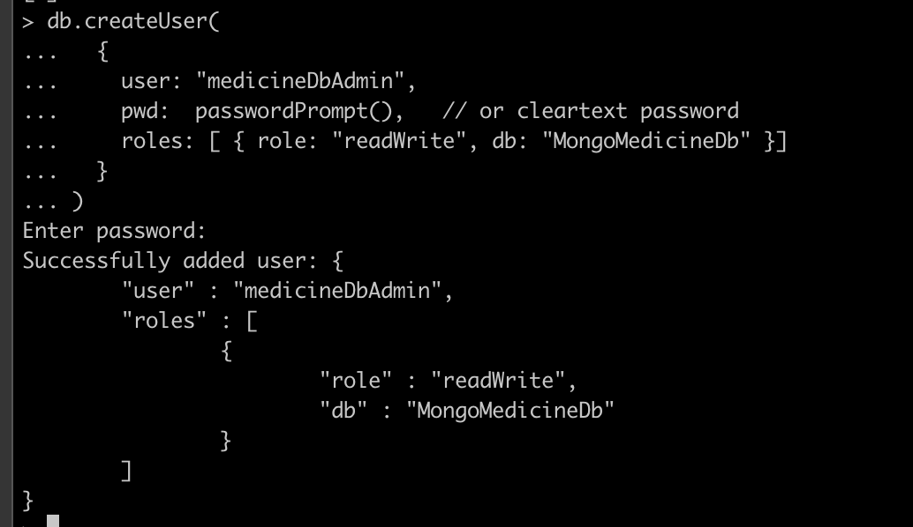
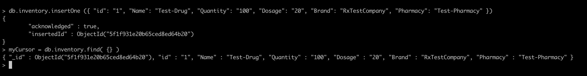
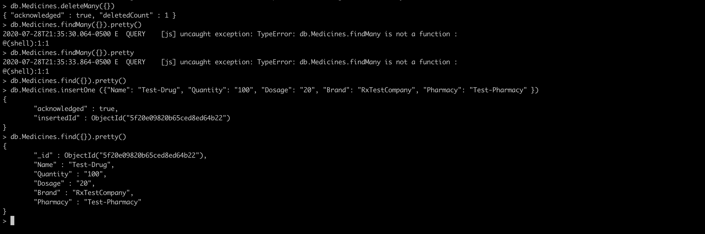
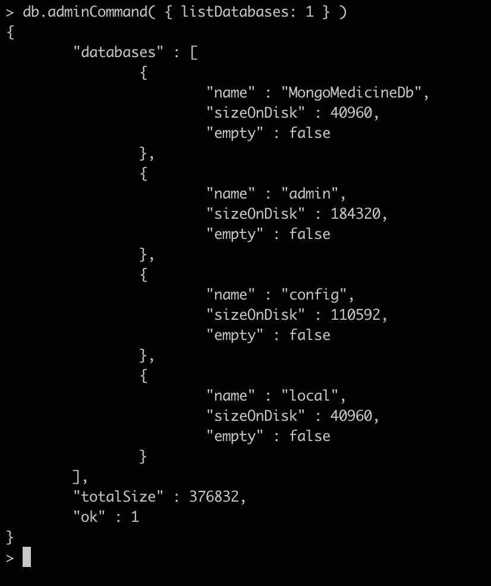
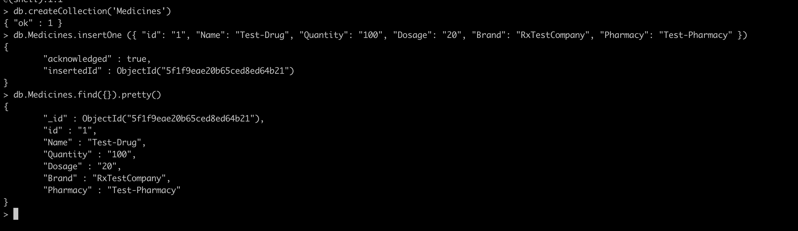

# dotnet_core_api_with_mongdb_docker_and_swagger

`https://docs.microsoft.com/en-us/aspnet/core/tutorials/first-mongo-app?view=aspnetcore-3.1&tabs=visual-studio`

## [Followed this Tutorial](https://dev.to/etnicholson/developing-a-crudapi-with-asp-net-core-mongodb-docker-swagger-cf4)

## [Helpful Swagger info for ASP.NET Core Web APIs](https://docs.microsoft.com/en-us/samples/aspnet/aspnetcore.docs/getstarted-swashbuckle-aspnetcore/?tabs=visual-studio)

## [Installing MongoDB on OSX](https://docs.mongodb.com/manual/tutorial/install-mongodb-on-os-x/)

* To run the app you can run `dotnet run` from within the project dir/ but the easier way is just press play in Visual Studio Code

* Swagger: `https://localhost:5001/swagger/index.html`

* brew doctor
* brew install mongodb-community@4.2
* brew link mongodb-community

* Personal MongoDB Monitoring URL => `https://cloud.mongodb.com/freemonitoring/cluster/7KTTFQMSVABU3QUT36WDRW2J2A7SPQBZ`

* Created the MongoDb inside the `MongoMedicineDb` with:  
   * `mongod --dbpath /Users/Ryanpd423/Desktop/Desktop_Ryans/dev/dotnet_apps/dotnet_core_api_with_mongodb_docker_and_swagger/MongoMedicineDb` 
   * this runs the mongodb in the `mongod` cli shell, open another zsh to interact (if you have not setup admin or user roles then see https://docs.mongodb.com/manual/tutorial/enable-authentication/ (setting up mongo db))
```
use admin
db.createUser(
  {
    user: "myUserAdmin",
    pwd: passwordPrompt(), // or cleartext password
    roles: [ { role: "userAdminAnyDatabase", db: "admin" }, "readWriteAnyDatabase" ]
  }
)
```

* To interact with Db
1. `mongo` - - this will launch the mongo shell, not to be confused with the `mongod` instance shell
2. `use MongoMedicineDb`
   * admin id: `myUserAdmin`
   * pw: `admin`
3. Authenticate into MongoDb:

4. Once authenticated as the user administrator, create additional users if you want:

* user: `medicineDbAdmin`
* pw: `admin`
* to see the profiles in this database try:
```
show users
```
* for general help with commands just type `help`

* Example of a shell write/read:


* Connection String for `appsettings.json`

* Delete-Find-Insert-Example


* 

* Setting up some test data:


* To create a new Database:
  1) `use {name of new database}`
  2) insert a new document/record: db.Medicines.insertOne 
   `({"Name": "Test-Drug", "Quantity": "100", "Dosage": "20", "Brand": "RxTestCompany", "Pharmacy": "Test-Pharmacy" })`
  * more details here => (https://docs.mongodb.com/manual/core/databases-and-collections/)


